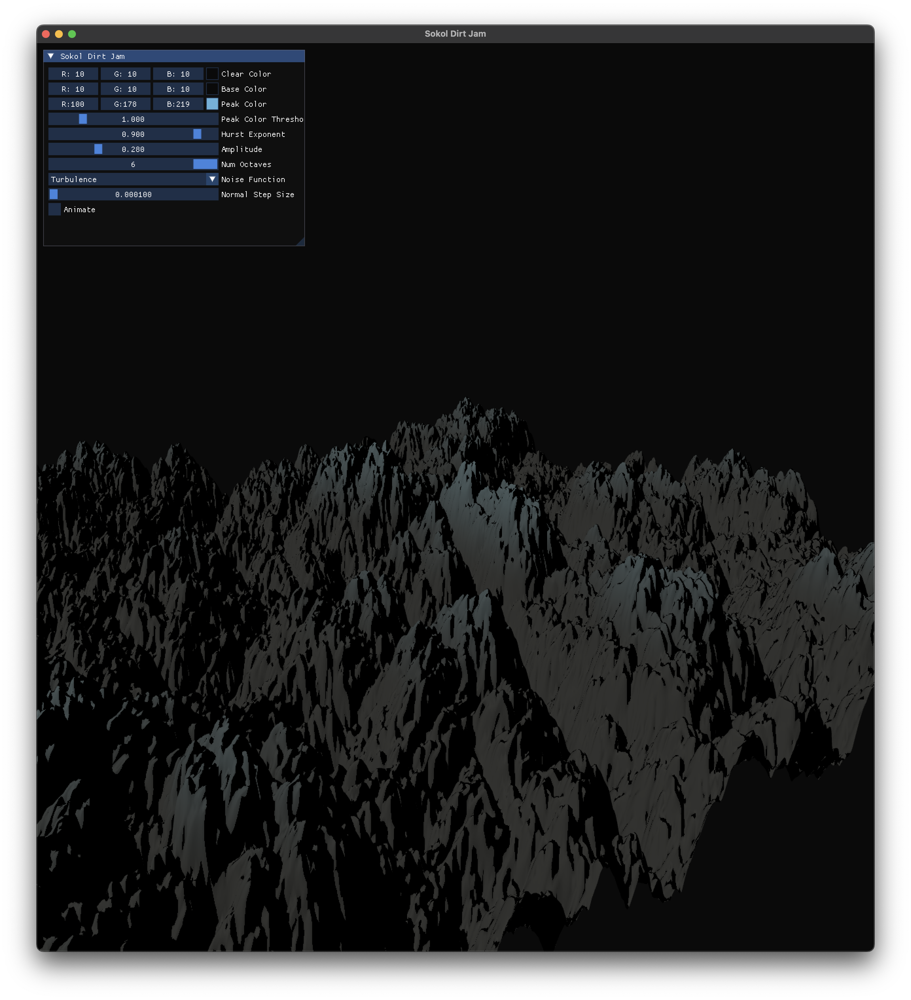

<div class="center">
    <h1>Sokol Dirt Jam</h1>
    
    <p>
        Rewrite of my original ThreeJs Entry for <a href="https://itch.io/jam/acerola-dirt-jam" target="_blank">Acerola's Dirt Jam</a> <b>C and Sokol</b>. This repo is based on <b>floooh's</b> awesome <b>cimgui-sokol-starterkit</b> which can be found <a href="https://github.com/floooh/cimgui-sokol-starterkit" target="_blank">here</a>.
    </p>

</div>

## :construction_worker: Build
> :warning: Please note that building only has been really tested on `MacOS`. See the instructions on the `cimgui-sokol-starterkit` Repo (link above) for other operating systems.

```bash
mkdir build
chmod +x ./build.sh
./build.sh # Build Development Version
./build.sh release # Build Release Version
```

## :game_die: Controls
For general tweaking of the scene you can use the `imgui controls` in the `top left` corner.

- Upon launch mouse is auto-captured. Press `X` to toggle the capture of the mouse
- Use `WASD` Keys to move around
- Use mouse to look around
- Press `Escape` to quit

## :clap: Acknowledgments
- [sokol quad example](https://floooh.github.io/sokol-html5/quad-sapp.html)
- [cimgui-sokol-starterkit](https://github.com/floooh/cimgui-sokol-starterkit)
- [Handmade Math](https://github.com/HandmadeMath/HandmadeMath)
- [Video about Procedural Generation](https://www.youtube.com/watch?v=FKLbihqDLsg&ab_channel=VictorGordan)
- [Camera Movement](https://learnopengl.com/Getting-started/Camera)
- [Simplex Noise GLSL](https://thebookofshaders.com/edit.php#11/2d-snoise-clear.frag)
- [Turbulence Noise](https://thebookofshaders.com/13/)
- [Calculating Normals with center difference method](https://iquilezles.org/articles/terrainmarching/)
- [Lighting Models covered in SimonDev's GLSL Course](https://simondev.teachable.com/p/glsl-shaders-from-scratch)
- [Sokol SHDC Tool for generating shaders](https://github.com/floooh/sokol-tools)
